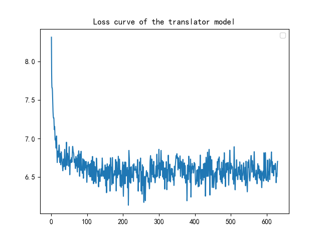

<h1><center>report in translator


## 模型结构

我们使用了基于Transformer架构的神经机器翻译（NMT）模型。具体模型结构如下：

- 编码器：
  - 包含词嵌入层和位置编码层。
  - 多层Transformer编码器层，每层包含多头自注意力机制和前馈神经网络。
- 解码器：
  - 包含词嵌入层和位置编码层。
  - 多层Transformer解码器层，每层包含自注意力机制、编码器-解码器注意力机制以及前馈神经网络。
- Transformer模型：
  - 输入层：源语言和目标语言的词嵌入和位置编码。
  - 输出层：一个线性层，将解码器的输出转换为目标语言的词汇分布。

## 训练方法描述

### 数据准备

- 数据集：
  - 使用由中文-俄语平行语料库训练，语料库包含平行的中文和俄语句子。
  
- 预处理：
  - 通过BERT分词器对句子进行分词，并使用填充和截断方法保证所有句子的长度一致。
  
  ```python
  tokenizer = Tokenizer.from_pretrained("bert-base-multilingual-cased")
  
  def ru_tokenizer(line):
      return tokenizer.encode(line, add_special_tokens=False).tokens
  
  def yield_ru_tokens():
      file = open(ru_filepath, encoding='utf-8')
      print("-------开始构建俄语词典-----------")
      for line in tqdm(file, desc="构建俄语词典", total=row_count):
          yield ru_tokenizer(line)
      file.close()
  
  ru_vocab
  ru_vocab_file = work_dir / "vocab_ru.pt"
  if use_cache and os.path.exists(ru_vocab_file):
      ru_vocab = torch.load(ru_vocab_file, map_location="cpu")
  else:
      ru_vocab = build_vocab_from_iterator(
          yield_ru_tokens(),
          min_freq=2,
          specials=["<s>", "</s>", "<pad>", "<unk>"],
      )
      ru_vocab.set_default_index(ru_vocab["<unk>"])
      if use_cache:
          torch.save(ru_vocab, ru_vocab_file)
  
  def zh_tokenizer(line):
      return list(line.strip().replace(" ", ""))
  
  
  def yield_zh_tokens():
      file = open(zh_filepath, encoding='utf-8')
      for line in tqdm(file, desc="构建中文词典", total=row_count):
          yield zh_tokenizer(line)
      file.close()
  
  zh_vocab_file = work_dir / "vocab_zh.pt"
  zh_vocab
  if use_cache and os.path.exists(zh_vocab_file):
      zh_vocab = torch.load(zh_vocab_file, map_location="cpu")
  else:
      zh_vocab = build_vocab_from_iterator(
          yield_zh_tokens(),
          min_freq=1,
          specials=["<s>", "</s>", "<pad>", "<unk>"],
      )
      zh_vocab.set_default_index(zh_vocab["<unk>"])
      torch.save(zh_vocab, zh_vocab_file)
  ```
  
  

### 训练配置

- 超参数：
  - 学习率：3e-4，使用GPU优化。
  - 批量大小：64
  - 训练次数：epochs（epochs默认为10）
  - 损失函数：使用KL散度损失函数（KLDivergence Loss）
  
  ```python
  class PositionalEncoding(nn.Module):
      def __init__(self, d_model, dropout, max_len=5000):
          super(PositionalEncoding, self).__init__()
          self.dropout = nn.Dropout(p=dropout)
          pe = torch.zeros(max_len, d_model).to(device)
          position = torch.arange(0, max_len).unsqueeze(1)
          div_term = torch.exp(
              torch.arange(0, d_model, 2).float() * (-(math.log(10000.0) / d_model))
          )
          pe[:, 0::2] = torch.sin(position * div_term)
          pe[:, 1::2] = torch.cos(position * div_term)
          pe = pe.unsqueeze(0)
          self.register_buffer("pe", pe)
  
      def forward(self, x):
          x = x + self.pe[:, : x.size(1)].requires_grad_(False)
          return self.dropout(x)
  
  class TranslationModel(nn.Module):
  
      def __init__(self, d_model, src_vocab, tgt_vocab, dropout=0.1):
          super(TranslationModel, self).__init__()
          self.src_embedding = nn.Embedding(len(src_vocab), d_model, padding_idx=2)
          self.tgt_embedding = nn.Embedding(len(tgt_vocab), d_model, padding_idx=2)
          self.positional_encoding = PositionalEncoding(d_model, dropout, max_len=max_length)
          self.transformer = nn.Transformer(d_model, dropout=dropout, batch_first=True)
          self.predictor = nn.Linear(d_model, len(tgt_vocab))
  
      def forward(self, src, tgt):
          tgt_mask = nn.Transformer.generate_square_subsequent_mask(tgt.size()[-1]).to(device)
          src_key_padding_mask = TranslationModel.get_key_padding_mask(src)
          tgt_key_padding_mask = TranslationModel.get_key_padding_mask(tgt)
  
          src = self.src_embedding(src)
          tgt = self.tgt_embedding(tgt)
          src = self.positional_encoding(src)
          tgt = self.positional_encoding(tgt)
  
          out = self.transformer(src, tgt,
                                 tgt_mask=tgt_mask,
                                 src_key_padding_mask=src_key_padding_mask,
                                 tgt_key_padding_mask=tgt_key_padding_mask)
  
          return out
  
      @staticmethod
      def get_key_padding_mask(tokens):
          return tokens == 2
  
  ```
  
  

## 收敛曲线



```python
class TranslationLoss(nn.Module):

    def __init__(self):
        super(TranslationLoss, self).__init__()
        self.criterion = nn.KLDivLoss(reduction="sum")
        self.padding_idx = 2

    def forward(self, x, target):
        x = log_softmax(x, dim=-1)
        true_dist = torch.zeros(x.size()).to(device)
        true_dist.scatter_(1, target.data.unsqueeze(1), 1)
        mask = torch.nonzero(target.data == self.padding_idx)
        if mask.dim() > 0:
            true_dist.index_fill_(0, mask.squeeze(), 0.0)
        return self.criterion(x, true_dist.clone().detach())
```


## 模型效果示例

因为数据量较小的缘故，模型的训练有点欠拟合，所以得出的效果并不是很好，特别在于辨识终止符号上不是很理想。对于较大的数据量来说，硬件不是很允许。
