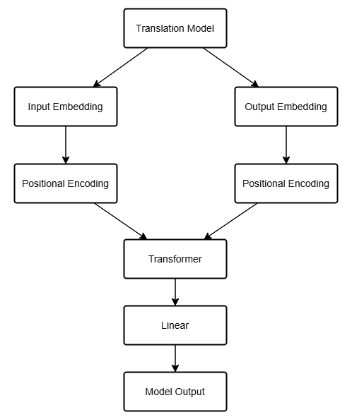
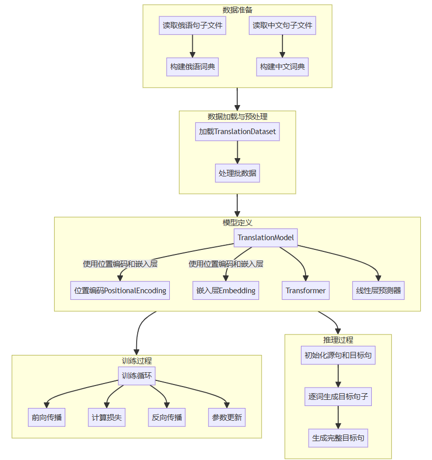
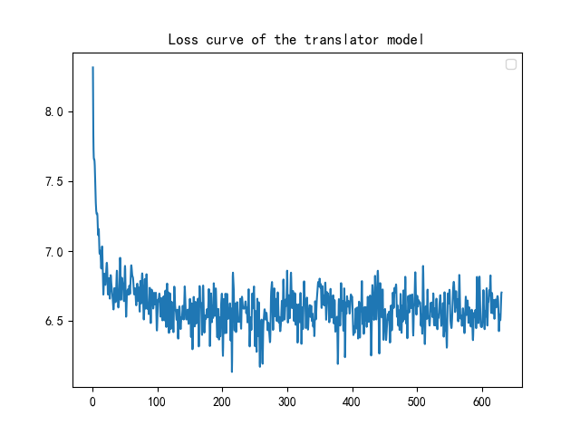
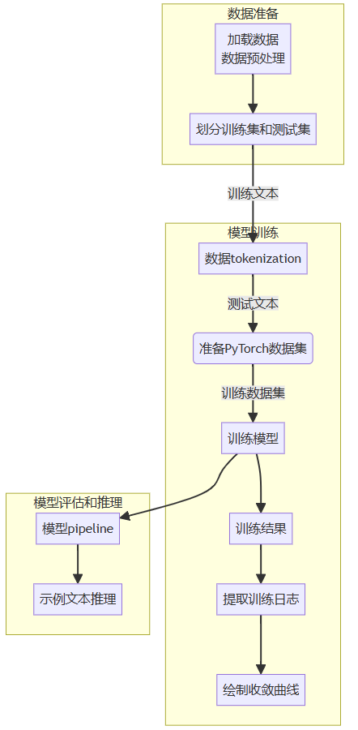
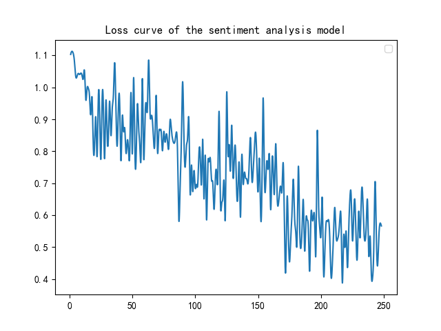

<h1><center> report

## 1 翻译器的模型结构

我们使用了基于Transformer架构的神经机器翻译（NMT）模型。具体模型结构如下：

- 编码器：
  - 包含词嵌入层和位置编码层。
  - 多层Transformer编码器层，每层包含多头自注意力机制和前馈神经网络。
- 解码器：
  - 包含词嵌入层和位置编码层。
  - 多层Transformer解码器层，每层包含自注意力机制、编码器-解码器注意力机制以及前馈神经网络。
- Transformer模型：
  - 输入层：源语言和目标语言的词嵌入和位置编码。
  - 输出层：一个线性层，将解码器的输出转换为目标语言的词汇分布。

模型的结构图如下图所示。




* Input Embedding：源语言，即中文的嵌入层，将离散的单词转换为连续实数向量表示。
* Output Embedding：目标语言，即俄语的嵌入层，将离散的单词转换为连续实数向量表示。
* Positional Encoding：注入位置信息，因为Transformer没有循环结构，需要显式地加入位置信息以理解句子中单词的顺序。
* Transformer：主要的编码解码结构，通过多头自注意力（Multi-head Self-attention）机制和前馈神经网络（Feed-Forward Neural Network）来处理输入序列。
* Linear：将Transformer的输出映射到目标语言词汇的分布，用于预测下一个单词。
* Model Output：模型输出的预测结果。

## 2 翻译器的训练方法描述

本次模型的详细结构图如下所示。



### 2.1 数据准备

- 数据集：

  - 使用由中文-俄语平行语料库训练，语料库包含平行的中文和俄语句子。

- 预处理：

  - 通过BERT分词器对句子进行分词，并使用填充和截断方法保证所有句子的长度一致。

  代码定义如下。

  ```python
  tokenizer = Tokenizer.from_pretrained("bert-base-multilingual-cased")
  
  def ru_tokenizer(line):
      return tokenizer.encode(line, add_special_tokens=False).tokens
  
  def yield_ru_tokens():
      file = open(ru_filepath, encoding='utf-8')
      print("-------开始构建俄语词典-----------")
      for line in tqdm(file, desc="构建俄语词典", total=row_count):
          yield ru_tokenizer(line)
      file.close()
  
  ru_vocab
  ru_vocab_file = work_dir / "vocab_ru.pt"
  if use_cache and os.path.exists(ru_vocab_file):
      ru_vocab = torch.load(ru_vocab_file, map_location="cpu")
  else:
      ru_vocab = build_vocab_from_iterator(
          yield_ru_tokens(),
          min_freq=2,
          specials=["<s>", "</s>", "<pad>", "<unk>"],
      )
      ru_vocab.set_default_index(ru_vocab["<unk>"])
      if use_cache:
          torch.save(ru_vocab, ru_vocab_file)
  
  def zh_tokenizer(line):
      return list(line.strip().replace(" ", ""))
  
  
  def yield_zh_tokens():
      file = open(zh_filepath, encoding='utf-8')
      for line in tqdm(file, desc="构建中文词典", total=row_count):
          yield zh_tokenizer(line)
      file.close()
  
  zh_vocab_file = work_dir / "vocab_zh.pt"
  zh_vocab
  if use_cache and os.path.exists(zh_vocab_file):
      zh_vocab = torch.load(zh_vocab_file, map_location="cpu")
  else:
      zh_vocab = build_vocab_from_iterator(
          yield_zh_tokens(),
          min_freq=1,
          specials=["<s>", "</s>", "<pad>", "<unk>"],
      )
      zh_vocab.set_default_index(zh_vocab["<unk>"])
      torch.save(zh_vocab, zh_vocab_file)
  ```

  

### 2.2 训练配置

- 超参数：

  - 学习率：3e-4，使用GPU优化。
  - 批量大小：64
  - 训练次数：epochs（epochs默认为10）
  - 损失函数：使用KL散度损失函数（KLDivergence Loss）

  代码定义如下。

  ```python
  class PositionalEncoding(nn.Module):
      def __init__(self, d_model, dropout, max_len=5000):
          super(PositionalEncoding, self).__init__()
          self.dropout = nn.Dropout(p=dropout)
          pe = torch.zeros(max_len, d_model).to(device)
          position = torch.arange(0, max_len).unsqueeze(1)
          div_term = torch.exp(
              torch.arange(0, d_model, 2).float() * (-(math.log(10000.0) / d_model))
          )
          pe[:, 0::2] = torch.sin(position * div_term)
          pe[:, 1::2] = torch.cos(position * div_term)
          pe = pe.unsqueeze(0)
          self.register_buffer("pe", pe)
  
      def forward(self, x):
          x = x + self.pe[:, : x.size(1)].requires_grad_(False)
          return self.dropout(x)
  
  class TranslationModel(nn.Module):
  
      def __init__(self, d_model, src_vocab, tgt_vocab, dropout=0.1):
          super(TranslationModel, self).__init__()
          self.src_embedding = nn.Embedding(len(src_vocab), d_model, padding_idx=2)
          self.tgt_embedding = nn.Embedding(len(tgt_vocab), d_model, padding_idx=2)
          self.positional_encoding = PositionalEncoding(d_model, dropout, max_len=max_length)
          self.transformer = nn.Transformer(d_model, dropout=dropout, batch_first=True)
          self.predictor = nn.Linear(d_model, len(tgt_vocab))
  
      def forward(self, src, tgt):
          tgt_mask = nn.Transformer.generate_square_subsequent_mask(tgt.size()[-1]).to(device)
          src_key_padding_mask = TranslationModel.get_key_padding_mask(src)
          tgt_key_padding_mask = TranslationModel.get_key_padding_mask(tgt)
  
          src = self.src_embedding(src)
          tgt = self.tgt_embedding(tgt)
          src = self.positional_encoding(src)
          tgt = self.positional_encoding(tgt)
  
          out = self.transformer(src, tgt,
                                 tgt_mask=tgt_mask,
                                 src_key_padding_mask=src_key_padding_mask,
                                 tgt_key_padding_mask=tgt_key_padding_mask)
  
          return out
  
      @staticmethod
      def get_key_padding_mask(tokens):
          return tokens == 2
  
  ```

  

## 3 翻译器的收敛曲线

翻译器模型的收敛曲线如下所示。



代码定义如下。

```python
class TranslationLoss(nn.Module):

    def __init__(self):
        super(TranslationLoss, self).__init__()
        self.criterion = nn.KLDivLoss(reduction="sum")
        self.padding_idx = 2

    def forward(self, x, target):
        x = log_softmax(x, dim=-1)
        true_dist = torch.zeros(x.size()).to(device)
        true_dist.scatter_(1, target.data.unsqueeze(1), 1)
        mask = torch.nonzero(target.data == self.padding_idx)
        if mask.dim() > 0:
            true_dist.index_fill_(0, mask.squeeze(), 0.0)
        return self.criterion(x, true_dist.clone().detach())
```


## 4 模型效果示例

因为数据量较小的缘故，模型的训练有点欠拟合，所以得出的效果并不是很好，特别在于辨识终止符号上不是很理想。对于较大的数据量来说，硬件不是很允许。


## 5 情感分析的模型结构

### 5.1 模型简介

本项目采用预训练的BERT模型来进行中文到俄语的翻译任务。具体使用的模型为 `bert-base-multilingual-cased`，支持多种语言，包括中文和俄语。该模型旨在解决文本分类问题，并且通过微调的方法应用于翻译任务。

### 5.2 模型结构

- **输入层**：文本输入，通过预训练的BERT分词器进行分词和编码。
- **嵌入层**：BERT模型对输入进行编码，将词汇转化为高维向量。
- **Transformer层**：12层Transformer，每层包含多头自注意力机制和前馈神经网络。
- **输出层**：全连接层，将Transformer层的输出用于标签分类，本项目中设置为3个分类标签（正面、负面、中立）。

情感分析模型的详细结构图如下。



## 6 训练方法描述

### 6.1 数据准备

我们从JSON文件中读取数据，并进行预处理。划分训练集和测试集，使用BERT分词器对文本进行编码。代码定义如下。

```python
import json
from sklearn.model_selection import train_test_split
import torch

def get_data(filepath):
    sentimap = {"positive": 1, "negative": 0, "neutral": 2}
    with open(filepath, 'r', encoding='utf-8') as file:
        dic = json.load(file)
    texts, labels = [], []
    for item in dic:
        m = item['sentiment']
        if m not in sentimap:
            continue
        text = item['text'].replace('\n', '').replace('Ctrl+Enter', '')
        texts.append(text)
        labels.append(sentimap[m])
    return texts, labels

texts, labels = get_data(filepath)
train_texts, test_texts, train_labels, test_labels = train_test_split(texts, labels, test_size=0.2, random_state=42)

tokenizer = AutoTokenizer.from_pretrained(model_name)
train_encodings = tokenizer(train_texts, padding=True, truncation=True, return_tensors='pt')
test_encodings = tokenizer(test_texts, padding=True, truncation=True, return_tensors='pt')

class SentimentDataset(torch.utils.data.Dataset):
    def __init__(self, encodings, labels):
        self.encodings = encodings
        self.labels = labels

    def __getitem__(self, idx):
        item = {key: torch.tensor(val[idx]) for key, val in self.encodings.items()}
        item['labels'] = torch.tensor(self.labels[idx])
        return item

    def __len__(self):
        return len(self.labels)

train_dataset = SentimentDataset(train_encodings, train_labels)
test_dataset = SentimentDataset(test_encodings, test_labels)

```


### 6.2 训练过程

使用Hugging Face的Trainer API进行训练，设置必要的训练参数，如训练周期数、批次大小、预热步骤等。代码定义如下。

```python
from transformers import Trainer, TrainingArguments

training_args = TrainingArguments(
    output_dir='./data/results',
    num_train_epochs=3,
    per_device_train_batch_size=8,
    per_device_eval_batch_size=8,
    logging_dir='./data/logs',
    warmup_steps=500,
    weight_decay=0.01,
    logging_steps=10,
)

trainer = Trainer(
    model=model,
    args=training_args,
    train_dataset=train_dataset,
    eval_dataset=test_dataset,
)

trainer.train()

```


## 7 收敛曲线

训练过程中记录损失值并绘制收敛曲线。通过这些曲线可以观察模型的训练效果和收敛速度。



## 8 模型效果

### 示例1

- **俄语（输入）：** Мне сегодня очень весело!（我今天玩得很开心！）

- **情感分析（输出）：** 

  ```
  Text: Мне сегодня очень весело!
  Sentiment: Score: 0.5730974674224854
  ```

### 示例2

- **俄语（输入）：** Сегодня хорошая погода.（今天天气很好。）

- **情感分析（输出）：** 

  ```
  Text: Сегодня хорошая погода!
  Sentiment: Score: 0.5570529103279114
  ```

### 示例3

- **俄语（输入）：** Я ненавижу этот фильм!（我讨厌这部电影！）

- **情感分析（输出）：** 

  ```
  Text: Я ненавижу этот фильм!
  Sentiment: Score: 0.8691123604774475
  ```

  
